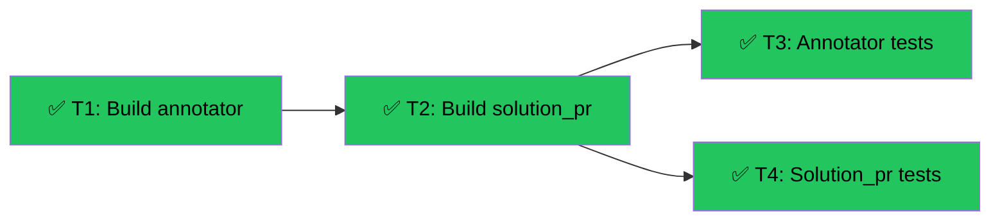

# Slice 5 — Annotation + Solution PR Generation
Branch: main | Level: 2 | Type: implement | Status: complete
Started: 2026-03-04

## DAG


## Tree
```
✅ T1: Build annotator [routine]
└──→ ✅ T2: Build solution_pr [routine]
     ├──→ ✅ T3: Annotator tests [routine]
     └──→ ✅ T4: Solution_pr tests [routine]
```

## Tasks

### T1: Build annotator module [implement] [routine]
- Scope: src/accessvision/output/annotator.py
- Verify: `python -c "from accessvision.output.annotator import annotate_screenshot; print('OK')"`
- Needs: none
- Status: done ✅

### T2: Build solution_pr module [implement] [routine]
- Scope: src/accessvision/output/solution_pr.py, src/accessvision/prompts/solution_pr.py
- Verify: `python -c "from accessvision.output.solution_pr import generate_solution_pr; print('OK')"`
- Needs: T1
- Status: done ✅

### T3: Annotator tests [test] [routine]
- Scope: tests/test_annotator.py
- Verify: `pytest tests/test_annotator.py -v`
- Needs: T1
- Status: done ✅

### T4: Solution_pr tests [test] [routine]
- Scope: tests/test_solution_pr.py, tests/fixtures/sample_fix.md
- Verify: `pytest tests/test_solution_pr.py -v`
- Needs: T2
- Status: done ✅

## Summary
Completed: 4/4 | Duration: ~5min
Files changed: src/accessvision/output/annotator.py, src/accessvision/output/solution_pr.py, src/accessvision/prompts/solution_pr.py, tests/test_annotator.py, tests/test_solution_pr.py, tests/fixtures/sample_fix.md
All verifications: passed
